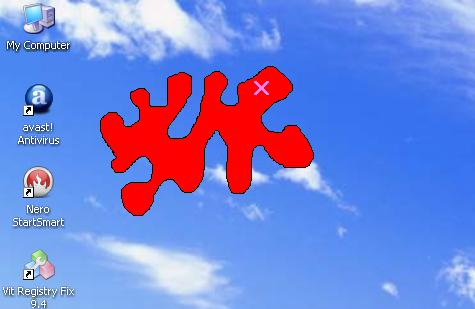



## FORM SHAPING

### Description

YOU CAN SHAPE FORM WITH A PICTURE DRAWN IN MS PAINT..
 
### More Info
 

             |
---                |---
**Submitted On**   |2009-03-22 08:25:48
**By**             |[MITHUN RAJ\.P](https://github.com/Planet-Source-Code/PSCIndex/blob/master/ByAuthor/mithun-raj-p.md)
**Level**          |Intermediate
**User Rating**    |5.0 (10 globes from 2 users)
**Compatibility**  |VB 6\.0
**Category**       |[Jokes/ Humor](https://github.com/Planet-Source-Code/PSCIndex/blob/master/ByCategory/jokes-humor__1-40.md)
**World**          |[Visual Basic](https://github.com/Planet-Source-Code/PSCIndex/blob/master/ByWorld/visual-basic.md)
**Archive File**   |[FORM\_SHAPI2154836132009\.zip](https://github.com/Planet-Source-Code/mithun-raj-p-form-shaping__1-72182/archive/master.zip)

